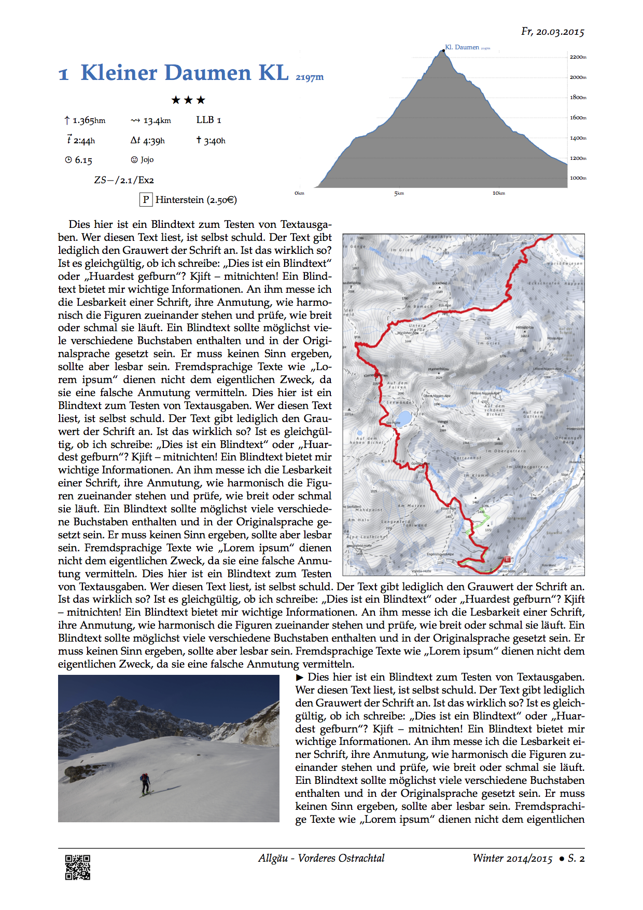

# Guidebook
This is a collection of my personal (mountain) tour guide (`Tourenbuch` in
german).



This repository should allow anyone to recreate the same layout, although one
should have experience with `LaTeX`, `Markdown` and the (unix) shell.(
Therefore i won't include instructions for setting up the required tools:
  * LaTex environment (using `pdflatex`)
  * Pandoc (for converting the markdown description to tex)
  * python3 (for the elevation profile, which is generated from `.gpx` files)

I use roughly one page for each tour description, which results in three major
page sections (see below).

## Installation
*These steps should be done once*

1. checkout this repo
2. create a directory in the root folder for your sport categories
(eg. `skitouren`, `mtb`)
3. adjust the `PROJECTROOT` variable in the [Makefile](meta/vorlagen/Makefile)

## Usage
*These steps are necessary for new activities*

1. copy the [Makefile](meta/vorlagen/Makefile)
2. run `$ make <activity type>` (eg. `$ make skitour`)
3. place your `.gpx` file in the new directory and name it `input.gpx`.
Then create the elevation profile `$ make gpxdata.txt`
4. make your adjustments to the [elevation.plt](meta/vorlagen/mtb/elevation.plt)
5. plot the elevation profile: `$ make elevation.plt` (resulting in a .pdf)
6. write your description in [beschreibung.md](skitouren/kl.daumen-20.03.2015/beschreibung.md)
7. register the new tour in the seasonal guidebook: `$ make register`
8. compile everything to a pdf: `$ make tourenbuch`

*A sample tour is visible [here](skitouren/kl.daumen-20.03.2015/).*
## Tour description
This includes a tabular header section, summarizing the tour data, like
overall distance, vertical height, time, ...

The summary as well as the tour description is written in
[markdown](https://en.wikipedia.org/wiki/Markdown) and alter converted.

> This is configured in the [beschreibung.md](skitouren/kl.daumen-20.03.2015/beschreibung.md)

## Elevation profile
The profile is created with `gnuplot` from extracted distance and heigth data
from a `.gpx` track.

The extracted plotting data is stored in [gpxdata.txt](skitouren/kl.daumen-20.03.2015/gpxdata.txt)

> The elevation profile is created with `make hoehenprofil.tex`

### Extract plotting data
With the [gpxplot.py](meta/gpxplot.py) tool, the neccessary plotting data is
extracted from a `.gpx` track.

```
$ python meta/gpxplot.py skitouren/NAME/NAME.gpx > skitouren/NAME/gpxdata.txt
```

The resulting file contains distance and elevation data (as csv), which can now be
plotted with the [gnuplot template file](skitouren/kl.daumen-20.03.2015/hoehenprofil.plt).

After running `gnuplot` a LaTeX file is created for the include in the
header segment.

## Map section
The map is usually just a screenshotted map overlay of the GPS track.

> The map should have [`karteninfo`](skitoren/kl.daumen-20.03.2015/karteninfo.png)
as a filename.
